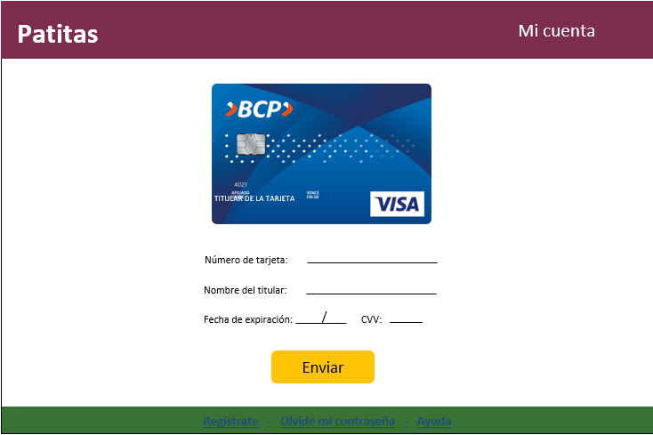

# Tarjeta de crédito válida
## 1. Resumen del proyecto
Este proyecto fue creado con la intención de proteger la información financiara
de aquellas personas que tienen mascotas y que requieren adquirir comida, juguetes,
entre otras para sus mascotas y lo hacen de manera virtual.
## 2. Resultado del proyecto

## 3. Investigación UX

**Usuarios**
Los principales usuarios son aquellas personas mayores de 18 años que tengan
mascotas y que requieren adquirir comida, juguetes, entre otras para sus hijos peludos.

**Como soluciona el problema**
En la actualidad, las compras por internet se han vuelto ensenciales para
muchas personas que no cuentan con el tiempo necesario de dirigirse presencialmente
por ello, es de suma importancia contar con una página web en la cual se pueda
pagar con tarjeta de crédito y sea segura para sus usuarios.

**Primer prototipo**

**Feedback recibido**
Un feedback recibido fue cambiar el fondo que inicialmente tenia la página,
ya que saturaba con facilidad la vista del usuario, además me recomendaron darle
forma al boton para que sea más amigable, del mismo modo mejorar los colores
de las letras como el resultado de la validación y del mensaje que aparece
cuando no digitan su tarjeta, todo esto para realzar el trabajo terminado y
se entiendan los mensajes con claridad.

**Prototipo final**
